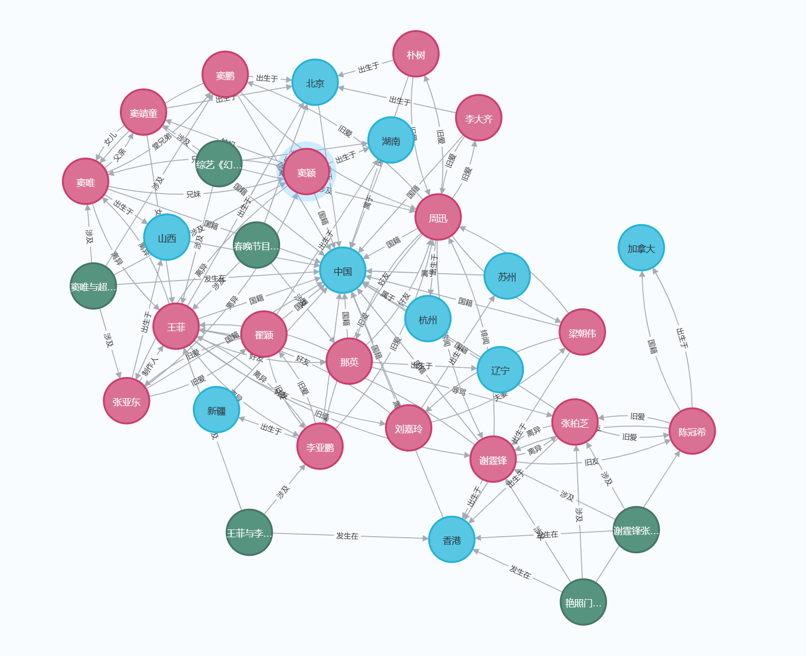

# 明星关系

## 图数据库角度

- 将各个明星设为实体节点，标签为明星。  
明星之间的关系直接用箭头连接起来  ，如窦唯与王菲离异。关系分单边与双边。  
- 将各个地点也设为实体节点，标签为地点。  
地点之间有从属关系，如香港属于中国。此外，明星与地点之间也用关系联系起来，如陈冠希出生于加拿大。    
- 将人物间的典型事件设为实体节点，标签为事件。  
事件与地点之间有关系，如艳照门事件发生在香港。事件与明星也有关系，如艳照门事件涉及陈冠希。

## 关系型数据库角度

## 拓展部分
### 1.复杂查询请求
设计了若干个复杂查询请求，分别用neo4j和mysql实现，详见extfunc文件夹。  

### 2.可视化展示