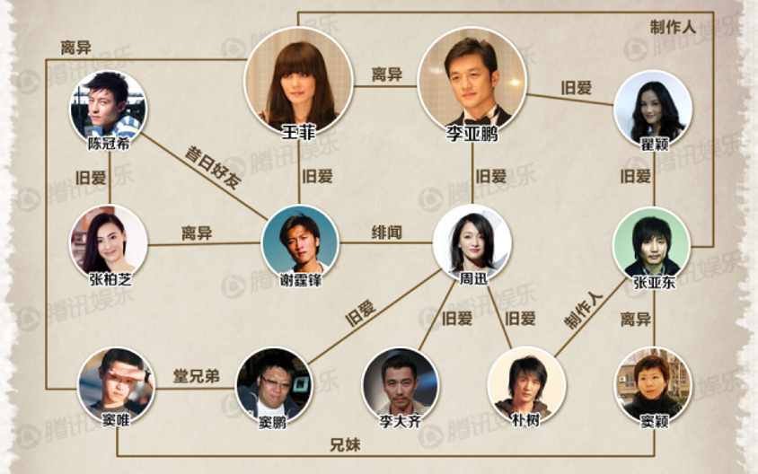
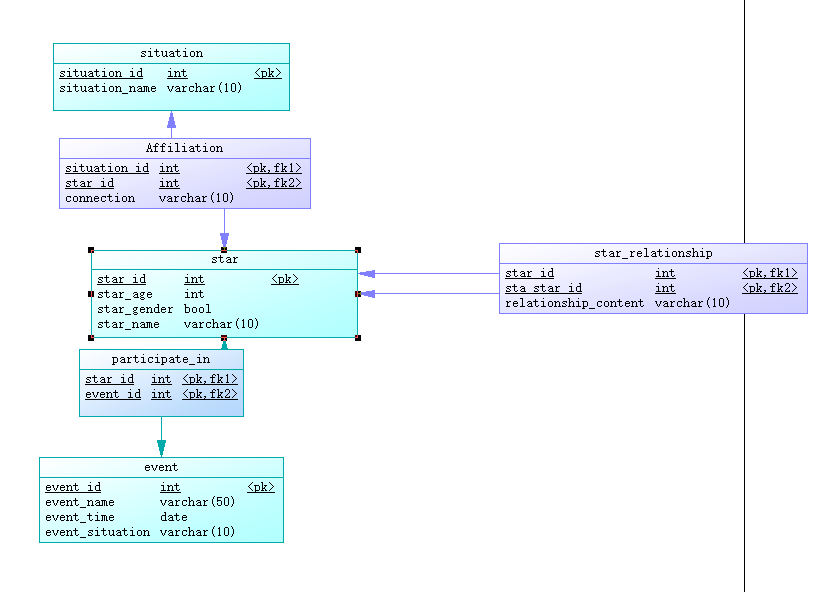

# 明星关系
  
存储各个明星之间的关系；添加明星的出生地、国籍等属性；增加明星间的典型事件，扩展关系网络。

## 图数据库角度

- 将各个明星设为实体节点，标签为明星。  
明星之间的关系直接用箭头连接起来  ，如窦唯与王菲离异。关系分单边与双边。  
- 将各个地点也设为实体节点，标签为地点。  
地点之间有从属关系，如香港属于中国。此外，明星与地点之间也用关系联系起来，如陈冠希出生于加拿大。    
- 将人物间的典型事件设为实体节点，标签为事件。  
事件与地点之间有关系，如艳照门事件发生在香港。事件与明星也有关系，如艳照门事件涉及陈冠希。

## 关系型数据库角度
### Flask+pymysql实现
- pymysql是最为简单且直接的和mysql数据库相连的方法。
- 使用powerdesigner完成ER图的设计。

- 这里一共设计了六张对应的表。
(1)star(star_id,star_name,star_age,star_gender)
(2)situation(situation_id,stuation_name)
(3)event(event_id,event_name,event_time,event_situation)
(4)star_relationship(star_id,sta_star_id,relationship_content)
(5)participate_in(star_id,event_id)
(6)affiliation(affiliation_id,situation_id,star_id,connection)
- 数据导入直接使用navicat即可，这部分的侧重点在拓展部分上。
### Django+mysqlclient实现
- Django与传统的mysql中的关系具体实现细节略有区别，但整体思路一致。
- 首先设计三个映射类，分别是：明星类、事件类、地点类。    
(1)明星的属性包括姓名、年龄、性别。    
(2)事件的属性包括发生时间、发生地点、事件的名称。   
(3)地点的属性包括地点的名称。
- 实现上述三个类内部以及相互之间的联系。   
(1)新增一个明星关系映射类，表示明星与明星之间的关系。明星类与明星类之间是多对多的关系，同时为关系新增一个属性以体现是什么关系（如“旧友”“旧爱”）。   
因为是同一个类之间的多对多关系，并且有为此多对多关系新增属性的需求，所以并没有使用的ManyToManyField来实现，而是选择新增了一个关系映射类，属性starA和starB都是此类的外键，都参考明星类，属性relationship是starA与starB的具体关系。   
(2)实现明星与事件的多对多关系。  
明星类与事件类之间是多对多关系，与(1)不同，明星与事件类的关系不需要新增属性。因此不新建一个映射类，而是直接在时间类中新增star属性做多对多映射：star = models.ManyToManyField('Star')。Django会自动建一张表，包含明星star的id、地点location的id以及自动生成的做主键的一个id。  
(3)新增一个地点与明星关系类，表示明星与地点的多对多关系。明星类与地点类之间是多对多的关系，同时为关系新增一个属性以体现是什么关系（如“国籍”“出生地”）。  
与(1)类似，因为是两个类间的多对多关系，并且有为此多对多关系新增属性的需求，所以并没有使用的ManyToManyField来实现，而是选择新增了一个关系映射类，属性loc和star都是此类的外键，loc参考地点类，star参考明星类，属性locrelation是star与loc的具体关系。   

## 拓展部分
### 1.复杂查询请求
- 设计了若干个复杂查询请求，分别用neo4j和mysql实现，详见extfunc文件夹。
- mysql第一种实现方法的复杂查询在代码内部实现，没有单独放出。具体表现为网页明星个人信息界面展示的后端部分。
### 2.可视化展示
由于可能您没有本地的数据库，我们先将可视化结果展示如下。
